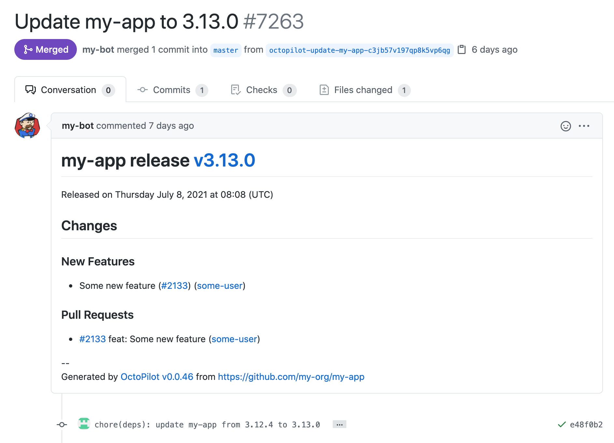
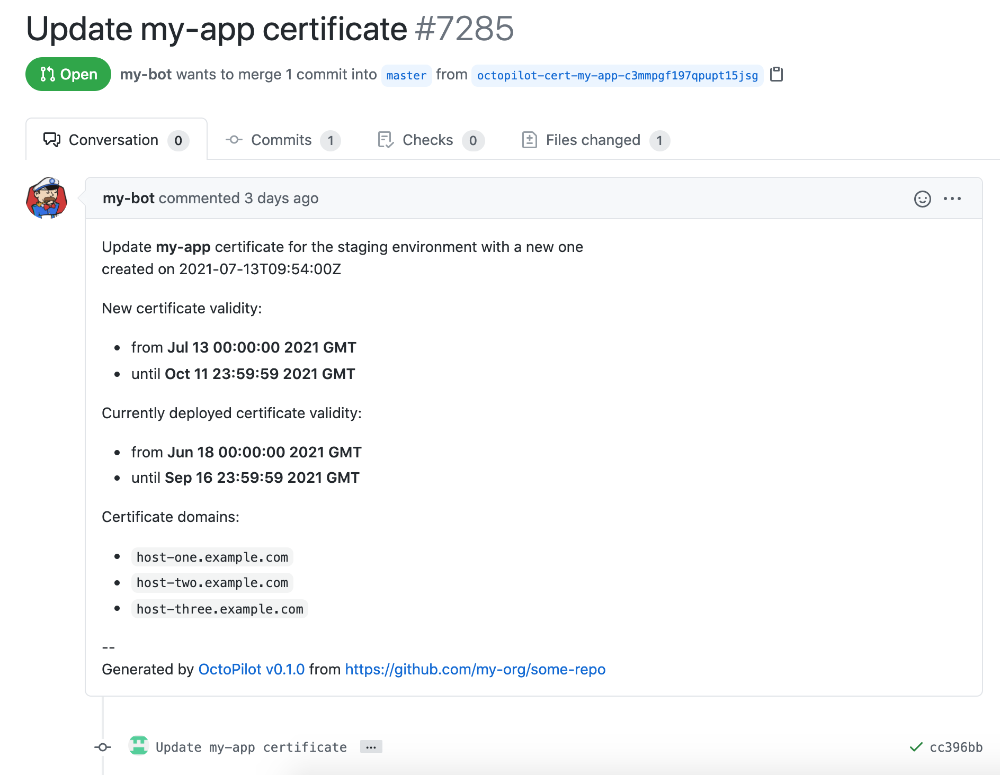

# Octopilot

[](https://goreportcard.com/report/github.com/dailymotion-oss/octopilot)
[](https://github.com/dailymotion-oss/octopilot/actions?query=workflow%3Arelease)
[](https://github.com/dailymotion-oss/octopilot/releases)
[](https://pkg.go.dev/github.com/dailymotion-oss/octopilot)

**Octopilot** is a CLI tool designed to help you automate your Gitops workflow, by automatically creating and merging GitHub Pull Requests to update specific content in Git repositories.

If you are doing Gitops with GitHub-hosted repositories, **Octopilot** is your *swiss army knife* to propagate changes in your infrastructure.

**Octopilot** was initially developed at [Dailymotion](https://www.dailymotion.com/), and is a core component of our Gitops workflow - you can read our blog post [Introducing Octopilot: a CLI to automate the creation of GitHub pull requests in your gitops workflow](https://vbehar.medium.com/introducing-octopilot-a-cli-to-automate-the-creation-of-github-pull-request-in-your-gitops-e49b9eb0177a).

---

## Features

- written in Go, and has **0 dependencies** - not even `git`
- native support for manipulating **YAML or JSON files** - which are commonly used in the Gitops world to describe resources
- native support for manipulating **files encrypted with [sops](https://github.com/mozilla/sops)** - because who wants to store non-encrypted sensitive data in git?
- supports **regex-based updates to any kind of files** - for these times when you need raw power 
- supports **executing any command/tool** - because you don't want to be limited by what we support
- supports **multiple strategies to create/update the PRs**
- supports **automatic merge of the PRs** - once the pre-configured CI checks are green
- can update **one or more GitHub repositories** from a single execution - including dynamically defined repositories, using a **GitHub search query**
- can execute **one or more update rules** in a single execution

---

## Documentation

- [User documentation](https://dailymotion-oss.github.io/octopilot/)
- [Contributing guide](CONTRIBUTING.md)
  - [Architecture](ARCHITECTURE.md)

---

## Example

Updating multiple repositories, and executing multiple update rules at once:

```bash
$ octopilot \
    --github-token "my-github-token" \
    --repo "my-org/some-repo" \
    --repo "my-org/another-repo(merge=true)" \
    --repo "discover-from(env=PROMOTE_TO_REPOSITORIES)" \
    --repo "discover-from(query=org:my-org topic:my-topic)" \
    --update "yaml(file=config.yaml,path='version')=file(path=VERSION)" \
    --update "yq(file=helmfile.yaml,expression='(.releases[] | select(.chart == \"repo/my-chart\") | .version ) = strenv(VERSION)')" \
    --update "sops(file=secrets.yaml,key=path.to.base64encodedCertificateKey)=$(kubectl -n cert-manager get secrets tls-myapp -o template='{{index .data \"tls.key\"}}')" \
    --pr-title "Updating some files" \
    ...
```

## Screenshots

### Pull Request to promote a new release of an application

Including the release notes in the Pull Request description



### Pull Request to update the certificates


